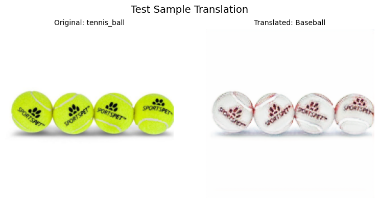

# CycleGAN-tennis-to-baseball
Implementation of the CycleGAN architecture to perform image-to-image translation of tennis balls to baseballs and vice versa.

## Data

The data we used for training and testing can be accessed by unzipping `data.zip` or downloading it [here](https://drive.google.com/file/d/191UIK3TQdiKUhullpVjACl-TOr8a49vN/view?usp=drive_link).

We use a subset of a sports ball dataset from Kaggle, keeping only the images relevant to this particular challenge (tennis balls and baseballs). Original dataset is [here](https://www.kaggle.com/datasets/samuelcortinhas/sports-balls-multiclass-image-classification).

## Method

We follow a typical CycleGAN architecture, following the original paper, visualized below:


Original paper and implementation of CycleGAN can be found [here](https://arxiv.org/abs/1703.10593).

Our loss objectives are the following:

#### Adversarial loss:
$$
\begin{align}
    \mathcal{L}_{\text{GAN}}(G,D_Y,X,Y) = \mathbb{E}_{y \sim p_{\text{data}}(y)}\left[\log D_Y(y)\right]
    + \mathbb{E}_{x \sim p_{\text{data}}(x)}\left[ \log (1-D_Y(G(x)) \right]
\end{align}
$$

#### Cycle-consistency loss:
$$
\begin{align}
    \mathcal{L}_{\text{cyc}}(G, F) =  \mathbb{E}_{x\sim p_{\text{data}}(x)}\left[\left\lVert {F(G(x))-x} \right\rVert_1\right]
    + \mathbb{E}_{y\sim p_{\text{data}}(y)}\left[ \left\lVert {G(F(y))-y} \right\rVert_1\right]
\end{align}
$$

#### Full objective:
$$
\begin{align}
     \mathcal{L}(G,F,D_X,D_Y) = \mathcal{L}_{\text{GAN}}(G,D_Y,X,Y)
    + \mathcal{L}_{\text{GAN}}(F,D_X,Y,X)
    + \lambda \mathcal{L}_{\text{cyc}}(G, F)
\end{align}
$$

With the addition of an **identity loss** to further enforce cycle consistency, defined as follows:

$$
\begin{align}
    \mathcal{L}_I(G) = \mathbb{E}_{x\sim p_{\text{data}}(x)} \left[ \left\lVert G(x) - x \right\rVert_1 \right]
\end{align}
$$

#### Ideal generators:
$$
\begin{equation}
    G^\*,F^\* = \arg\min_{G,F}\max_{D_x,D_Y} \mathcal{L}(G, F, D_X, D_Y)
\end{equation}
$$

## Model architecture + training

We implement an encoder-decoder structure for the generators, using standard convolution as well as residual blocks for better gradient flow.

The discriminator models follow a [PatchGAN](https://openaccess.thecvf.com/content_CVPR_2020/papers/Zou_Deep_Adversarial_Decomposition_A_Unified_Framework_for_Separating_Superimposed_Images_CVPR_2020_paper.pdf) style, outputting a feature map of authenticity scores rather than a singular value.

We also implement a learning rate scheduler to dynamically adjust the learning rate throughout training. For this challenge, we linearly decay the initial learning rate $\eta$, starting from the midpoint of training (`num_epochs // 2`). This helps to achieve strong momentum in early epochs while gradually minimizing the steps as we approach convergence.

Currently, our best results have been achieved on the following hyperparameters:
```
cyc_lambda = 15
identity_lambda = 5
lr = 0.0002
num_epochs = 150
beta1, beta2 = 0.5, 0.999
```

## Example result


