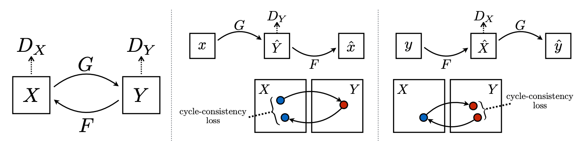

# CycleGAN-tennis-to-baseball
CycleGAN implementation to perform image-to-image translation of tennis balls to baseballs

Original paper and implementation of CycleGAN found [here](https://arxiv.org/abs/1703.10593).

## Method

#### Adversarial loss:
$$
\begin{align}
    \mathcal{L}_{\text{GAN}}(G,D_Y,X,Y) =& \ \mathbb{E}_{y \sim p_{\text{data}}(y)}[\log D_Y(y)] \nonumber \\
   +& \ \mathbb{E}_{x \sim p_{\text{data}}(x)}[\log (1-D_Y(G(x))]
\end{align}
$$

#### Cycle-consistency loss:
$$
\begin{align}
    \mathcal{L}_{\text{cyc}}(G, F) =  & \ \mathbb{E}_{x\sim p_{\text{data}}(x)}[\left\lVert {F(G(x))-x} \right\rVert_1] \nonumber \\
    + &\ \mathbb{E}_{y\sim p_{\text{data}}(y)}[ \left\lVert {G(F(y))-y} \right\rVert_1]
\end{align}
$$

#### Full objective:
$$
\begin{align}
     \mathcal{L}(G,F,D_X,D_Y) = &、 \mathcal{L}_{\text{GAN}}(G,D_Y,X,Y) \nonumber \\
    +&\ \mathcal{L}_{\text{GAN}}(F,D_X,Y,X) \nonumber \\
    +& \  \lambda \mathcal{L}_{\text{cyc}}(G, F)
\end{align}
$$

#### Ideal generators:
$$
\begin{equation}
    G^*,F^* = \arg\min_{G,F}\max_{D_x,D_Y} \mathcal{L}(G, F, D_X, D_Y)
\end{equation}
$$

## Data

The data we used for training and testing can be accessed [here](https://drive.google.com/file/d/191UIK3TQdiKUhullpVjACl-TOr8a49vN/view?usp=drive_link).

We use a subset of a sports ball dataset from Kaggle, keeping only the images relevant to this particular challenge (tennis balls and baseballs). Original dataset is [here](https://www.kaggle.com/datasets/samuelcortinhas/sports-balls-multiclass-image-classification).